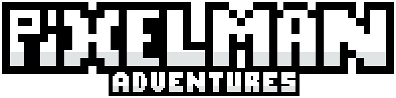

	

# PixelMan Adventures
A simple open source platformer game about going from point A to point B without dying.

## Development
The game is still in development and in a very early stage, so,
if you want to help, you can do it by contributing to the project.
You can also help by reporting bugs or suggesting new features,
but please understand that our focus is on completing the game
first, so we may not be able to implement your suggestions right away.

A few resources are available to getting involved and understanding the project:
- There's a detailed [change log](CHANGELOG.md) available to see what's
new in each version.
- You can also check the [project roadmap](ROADMAP.md) to see what's coming next.
- If you want to contribute, you can check the
[contribution guidelines](CONTRIBUTING.md) to see how to do it.

Just a note: the game is still in early development, so the code is
not very well organized and there are a lot of things that need to
be improved. If you want to contribute, please keep that in mind.

Also, the game itself it's coded using[Unity 2021.3.0f1](https://unity3d.com/download).
Please mantain the same version to avoid any problems.

### Versioning notes
The game versioning is based on the [Semantic Versioning](https://semver.org/)
standard. The versioning is based on the following format: `MAJOR.MINOR.PATCH`.
- The `MAJOR` version is incremented when a major change is made to the game.
- The `MINOR` version is incremented when a minor change is made to the game.
- The `PATCH` version is incremented when a patch is made to the game.

When working on development, the versioning is based on the following
format: `MAJOR.MINOR.PATCH-DEV`.

When working on a public beta, the versioning is based on the following
format: `MAJOR.MINOR.PATCH-BETA`.

## Compilation
The game is compiled using `IL2CPP`. If you're not familiar with IL2CPP,
you can read the [documentation](https://docs.unity3d.com/Manual/IL2CPP.html)
to learn more about it.

## Contributing
If you want to contribute to the project, please follow the
[coding style](CODING_STYLE.md) and the [code of conduct](CODE_OF_CONDUCT.md).

We love contributions! So, feel free to contribute to the project as
much as you want. Let's make the best platformer game ever!

## License
This project is licensed under the [GNU Affero General Public License v3.0](LICENSE).
